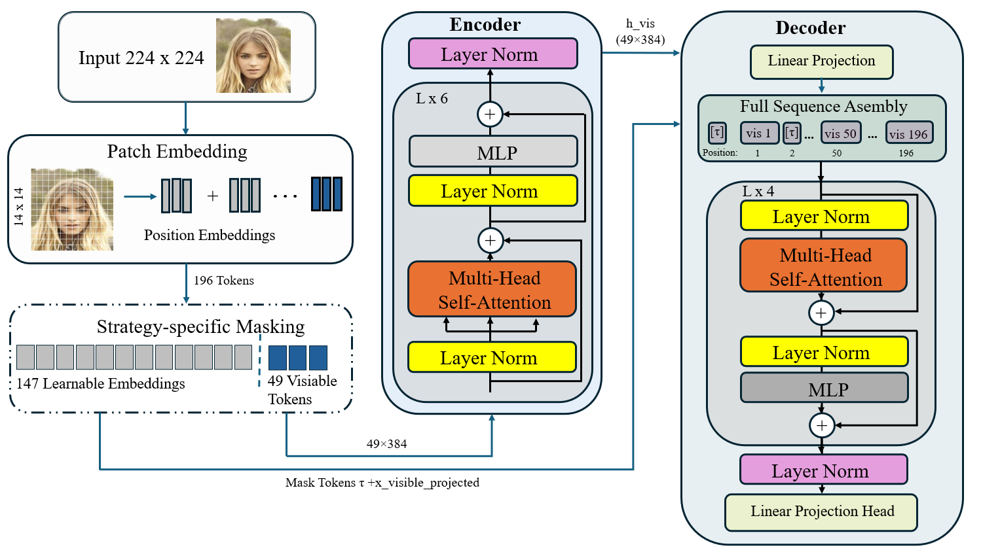
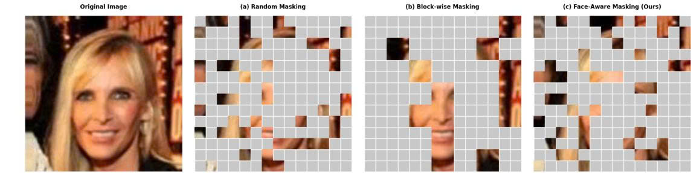
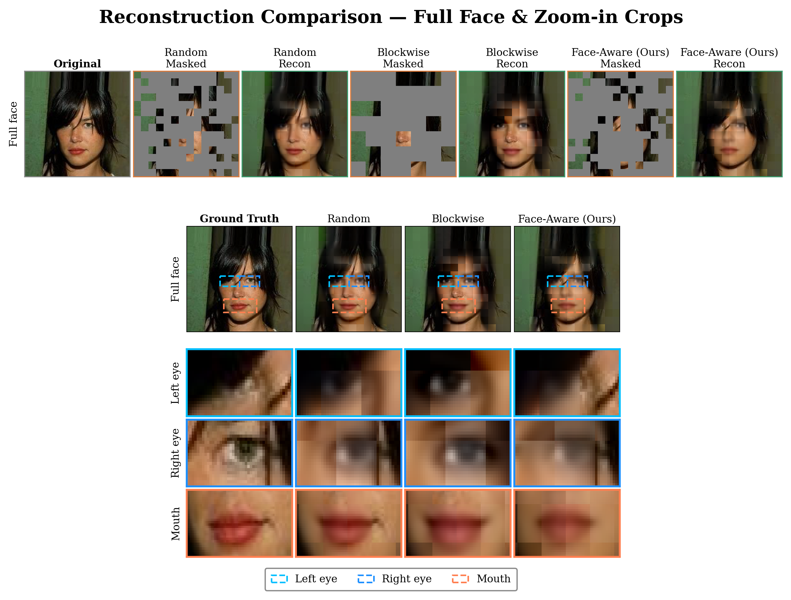

# Face-Aware Pretraining Strategy for Masked Autoencoders

<div align="center">

[](https://www.python.org/)
[](https://pytorch.org/)
[](LICENSE)
[](https://www.kaggle.com/)

**A domain-specific masking strategy for Masked Autoencoders (MAE) that concentrates reconstruction difficulty on semantically critical facial regions — eyes, nose, and mouth.**

[📄 Paper](#paper) · [🗂️ Repository Structure](#repository-structure) · [⚙️ Method](#method) · [🚀 Quick Start](#quick-start) · [📊 Results](#results) · [📓 Notebooks](#notebooks)

</div>

---

## Overview

Standard MAE pre-training applies **random masking** uniformly across all image patches. For face recognition tasks, this is suboptimal because a face image's identity information is disproportionately concentrated in a small set of critical facial regions — the eyes, nose, and mouth.

This project proposes **Face-Aware Masking**, a biologically-motivated, structure-preserving masking strategy that:

1. **Detects critical facial patches** (eyes, nose, mouth) using landmark-guided region masks pre-computed for the CelebA dataset.
2. **Preferentially masks** a higher fraction `ρ` (critical ratio) of these critical patches while still masking remaining patches at random to maintain the global 75% mask rate.
3. **Applies region-weighted loss**, scaling the MSE loss by **2.0×** on critical patches and **0.5×** on background — forcing the encoder to build richer representations of identity-relevant regions.

This approach is compared against two baselines:
- **Random Masking** — the standard MAE approach (He et al., 2022)
- **Block-wise Masking** — spatially contiguous block masking (Singh et al., 2023)

---

## Overall Pipeline



> The MAE pipeline: (1) A 224×224 face image is divided into a 14×14 grid of 16×16 patches. (2) A strategy-specific masking module selects 147 tokens to hide, keeping 49 visible. (3) The ViT-Small encoder (6 layers, dim=384, 6 heads) processes only the 49 visible tokens. (4) The lightweight decoder (4 layers, dim=256, 8 heads) reconstructs all 196 patches from visible encodings + learnable mask tokens.

---

## Masking Strategy Visualization



> **(a) Random Masking** — Uniform random selection across all 196 patches.  
> **(b) Block-wise Masking** — Spatially contiguous 2×2 block groups are masked together.  
> **(c) Face-Aware Masking (Ours)** — Critical facial region patches are preferentially masked at ratio `ρ`, while background patches fill the remaining quota to maintain the global 75% mask rate.

---

## Repository Structure

```
FaceawareStrategyMAE/
│
├── face_aware/
│   └── mae-training-face-aware.ipynb     # Main training notebook (Face-Aware Masking)
│
├── blockwise/
│   └── blockwise.ipynb                   # Baseline: Block-wise Masking training
│
├── random/
│   └── random.ipynb                      # Baseline: Random Masking training
│
├── linear_probing/
│   └── linear-probing.ipynb              # Downstream evaluation via linear probing
│
├── paper/
│   └── FaceAwarePretrainingStrategy.pdf  # Full research paper
│
└── README.md
```

---

## Method

### 1. Dataset

All models are trained on a preprocessed version of **CelebA** (202,558 celebrity face images, aligned and cropped to 224×224):

| Split | Samples | Batches (BS=256) |
|-------|---------|-----------------|
| Train | 182,302 | 712 |
| Val   | 20,256  | 40  |

A pre-computed dictionary `all_region_masks.pt` maps each image ID to a binary vector of length 196, where `1` indicates a critical facial patch (covering eyes, nose, mouth).

**Critical patch statistics:** mean ≈ 32 patches, range [18, 47] per image.

### 2. Model Architecture

All three variants share an **identical ViT-Small backbone** — only the masking strategy and loss function differ.

| Component | Config |
|-----------|--------|
| **Encoder** | ViT-Small: depth=6, embed_dim=384, heads=6 |
| **Decoder** | Lightweight: depth=4, embed_dim=256, heads=8 |
| **Total Params** | ~14.5M (Encoder 11.0M + Decoder 3.5M) |
| **Input** | 224×224 RGB → 196 patches of 16×16 |
| **Visible patches** | 49 (25%, mask ratio = 0.75) |

### 3. Masking Strategies

#### Random Masking (Baseline)
```python
class RandomMasking:
    def generate_mask(self, batch_size, region_masks=None):
        num_masked  = int(self.mask_ratio * self.num_patches)  # 147
        noise       = torch.rand(batch_size, self.num_patches)
        ids_shuffle = torch.argsort(noise, dim=1)
        mask        = torch.zeros(batch_size, self.num_patches, dtype=torch.bool)
        mask.scatter_(1, ids_shuffle[:, :num_masked], True)
        return mask
```
Uniformly samples 147 of 196 patches to mask — no spatial or semantic bias.

#### Block-wise Masking (Baseline)
```python
class BlockwiseMasking:
    def __init__(self, mask_ratio=0.75, block_size=2):
        self.grid_size  = 14   # 14×14 patch grid
        self.block_size = 2    # 2×2 block = 4 patches each
```
Randomly selects 2×2 contiguous block units to mask, introducing spatial regularity.

#### Face-Aware Masking (Ours)
```python
class FaceAwareMasking(MaskingStrategy):
    """
    mask_ratio    : global mask rate (fixed 0.75)
    critical_ratio: fraction ρ of K critical patches to mask (ablated at 0.7/0.8/0.9)
    """
    def generate_mask(self, batch_size, region_masks=None):
        for i in range(batch_size):
            critical   = (region_masks[i] == 1).nonzero()   # identity-critical patches
            background = (region_masks[i] == 0).nonzero()   # background patches

            # Step 1: mask ρ × |critical| critical patches
            num_critical_mask = min(int(self.critical_ratio * len(critical)), num_to_mask)
            crit_perm = critical[torch.randperm(len(critical))[:num_critical_mask]]

            # Step 2: fill remaining quota from background
            num_bg_mask = num_to_mask - num_critical_mask
            bg_perm     = background[torch.randperm(len(background))[:num_bg_mask]]
```

### 4. Region-Weighted Loss

The Face-Aware model applies an asymmetric loss weight that amplifies gradient signal on critical regions:

```python
def _compute_loss(self, imgs, pred, mask, region_masks=None):
    target = self.patchify(imgs)
    # Normalize pixel values per-patch
    if self.norm_pix_loss:
        mean   = target.mean(dim=-1, keepdim=True)
        var    = target.var(dim=-1, keepdim=True)
        target = (target - mean) / (var + 1e-6).sqrt()

    loss = ((pred - target) ** 2).mean(dim=-1)  # [B, 196]

    # Region-weighted: 2.0× on critical patches, 0.5× on background
    if self.region_weighted and region_masks is not None:
        weights = 2.0 * region_masks.float() + 0.5 * (1 - region_masks.float())
        loss    = loss * weights

    return (loss * mask.float()).sum() / (mask.float().sum() + 1e-6)
```

### 5. Training Configuration

| Hyperparameter | Value |
|----------------|-------|
| Optimizer | AdamW (β₁=0.9, β₂=0.95) |
| Base LR | 1.5×10⁻⁴ |
| Min LR | 1×10⁻⁶ |
| LR Schedule | Cosine decay with 10-epoch warmup |
| Weight Decay | 0.05 |
| Gradient Clip | 1.0 |
| Batch Size | 256 |
| Epochs | 100 |
| Hardware | 2× Tesla T4 (Kaggle) |
| Mixed Precision | AMP (autocast + GradScaler) |

---

## Results

### Reconstruction Quality



> **Full face and zoom-in crop comparison** of all three strategies. Face-Aware masking (ours) produces sharper reconstructions on identity-critical regions (eyes, mouth) relative to Random and Block-wise baselines.

### Quantitative Comparison

**Unweighted Localized MSE on CelebA Validation Set** (mean ± std over 3 seeds):

| Strategy | MSE Overall ↓ | MSE Critical (eyes/mouth) ↓ | MSE Background ↓ |
|----------|-------------|---------------------------|----------------|
| Random | 0.3302 ± 0.002 | 0.2180 ± 0.003 | 0.3502 ± 0.002 |
| Block-wise | 0.3418 ± 0.004 | 0.2286 ± 0.005 | 0.3598 ± 0.004 |
| **Face-Aware (ρ=0.9)** | **0.3289 ± 0.003** | **0.2164 ± 0.003** | **0.3489 ± 0.003** |

### Linear Probing (Downstream Evaluation)

Linear probe trained on frozen MAE encoder features, evaluated on three CelebA binary attributes:

| Strategy | Smiling ↑ | Eyeglasses ↑ | Male ↑ |
|----------|-----------|-------------|--------|
| Random | 81.21 ± 0.08 | 97.28 ± 0.14 | **97.61 ± 0.01** |
| Block-wise | 80.94 ± 0.12 | 97.18 ± 0.18 | 96.97 ± 0.09 |
| **Face-Aware** | **81.84 ± 1.15** | **97.44 ± 0.27** | 96.88 ± 0.15 |

> Face-Aware achieves best accuracy on **Smiling** (+0.63 pp vs Random) and **Eyeglasses** (+0.16 pp), both of which are localized to identity-critical facial regions. The slight underperformance on **Male** reflects the trade-off: by concentrating on local facial patches, the encoder learns less holistic face structure — which gender classification relies on more heavily.

### Ablation: Critical Ratio ρ

| ρ | MSE Overall ↓ | MSE Critical ↓ | MSE Background ↓ |
|---|-------------|--------------|----------------|
| 0.7 | 0.3298 | 0.2218 | 0.3490 |
| **0.8** | **0.3293** | **0.2215** | **0.3486** |
| 0.9 | 0.3289 | 0.2214 | 0.3489 |

> **ρ=0.9** achieves the best overall and critical-region MSE. **ρ=0.8** is selected as the balanced operating point: it achieves competitive identity fidelity (MSE_C = 0.2215, +0.04% vs ρ=0.9) while limiting background degradation — consistent with the scale-preservation constraint derived in the paper.

---

## Quick Start

### Prerequisites

```bash
pip install torch torchvision timm einops tqdm
```

### Dataset Preparation

The project uses CelebA images pre-cropped to 224×224 and a pre-computed face region mask file:

```
celeba-processed-224/
└── processed/
    └── images/         # *.jpg files (202,558 images)

all_region_masks.pt     # dict[str → Tensor(196,)] — pre-computed critical patch masks
```

Region masks are pre-computed using facial landmark detection. Each image's 14×14 patch grid is annotated with `1` (critical: eyes/nose/mouth) or `0` (background).

### Running on Kaggle

All notebooks are designed for Kaggle with 2× T4 GPU acceleration:

1. Upload `celeba-processed-224` and `all_region_masks.pt` as Kaggle datasets.
2. Open the desired notebook:
   - `face_aware/mae-training-face-aware.ipynb` — Face-Aware MAE (ours)
   - `blockwise/blockwise.ipynb` — Block-wise baseline
   - `random/random.ipynb` — Random baseline
3. Configure data paths at the top of each notebook:
   ```python
   DATA_DIR     = "/kaggle/input/datasets/doandangkhoa/celeba-processed-224"
   MASK_PT_PATH = "/kaggle/input/datasets/doandangkhoa/mae-compare/all_region_masks.pt"
   ```
4. Run all cells. Checkpoints are saved to `/kaggle/working/checkpoints/`.

### Resuming Training

```python
trained_model, history = train_mae(
    model=model,
    ...
    resume_from="/kaggle/working/checkpoints/mae_face_aware_rho9/latest.pth",
    device=device
)
```

---

## Notebooks

| Notebook | Description |
|----------|-------------|
| [`face_aware/mae-training-face-aware.ipynb`](face_aware/mae-training-face-aware.ipynb) | Full pipeline: dataset loading with pre-computed region masks, `FaceAwareMasking`, `MAEEncoder` (ViT-Small), `MAEDecoder`, region-weighted loss, cosine LR scheduler, multi-GPU training with AMP, checkpoint saving/resuming |
| [`blockwise/blockwise.ipynb`](blockwise/blockwise.ipynb) | Same architecture with `BlockwiseMasking` (2×2 blocks), standard MSE loss, identical training loop |
| [`random/random.ipynb`](random/random.ipynb) | Same architecture with `RandomMasking`, standard MSE loss — the canonical MAE baseline |
| [`linear_probing/linear-probing.ipynb`](linear_probing/linear-probing.ipynb) | Downstream evaluation: freeze encoder, train a linear classifier on CelebA attributes (Smiling, Eyeglasses, Male) |

---

## Paper

📄 **[Face-Aware Pretraining Strategy for Masked Autoencoders](paper/FaceAwarePretrainingStrategy.pdf)**

> Đỗ Đăng Khoa et al. (2026). *Face-Aware Pretraining Strategy for Masked Autoencoders*. FPT University, DSP391m Final Report.

**Abstract excerpt:** We propose a domain-specific pretraining strategy for Masked Autoencoders (MAE) applied to facial images. By leveraging pre-computed facial landmark masks to identify identity-critical patches, our Face-Aware masking concentrates reconstruction difficulty on semantically meaningful regions during self-supervised pretraining on CelebA. Combined with a region-weighted reconstruction loss, the approach yields improved localized MSE on critical facial regions and superior linear probing accuracy on identity-related CelebA attributes, compared to Random and Block-wise masking baselines.


---

## Acknowledgements

- **MAE (He et al., 2022)**: [Masked Autoencoders Are Scalable Vision Learners](https://arxiv.org/abs/2111.06377)
- **CelebA**: [Large-scale CelebFaces Attributes Dataset](https://mmlab.ie.cuhk.edu.hk/projects/CelebA.html)
- **timm**: [PyTorch Image Models](https://github.com/huggingface/pytorch-image-models)

